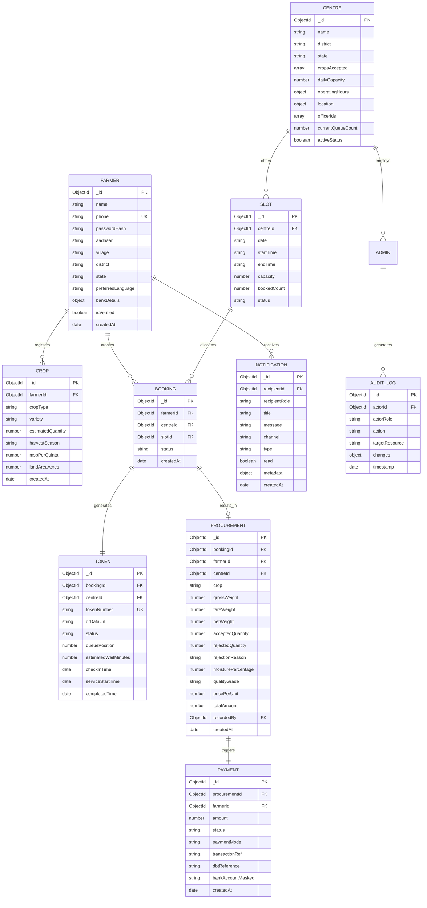
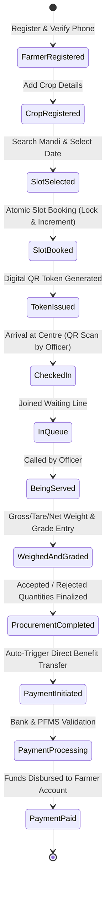

# Software Requirements Specification (SRS) & Database ER Diagram
## Kisan Setu — Intelligent Agricultural Procurement Platform
**SIH Problem Statement 26032**

---

## 1. Introduction
The **Kisan Setu** platform is an intelligent, capacity-aware agricultural procurement management system designed to eliminate congestion, long waiting times, distress selling, and opaque grading at Agricultural Produce Market Committee (APMC) mandis and government procurement centres.

### 1.1 Target Users
1. **Farmers**: Register crops, find nearby mandis, book capacity-aware slots, obtain digital QR tokens, track real-time queue ETA, speak to the AI Voice Assistant in regional languages, and track direct benefit transfer (DBT) payments.
2. **Procurement Officers**: Manage daily slot arrivals, scan farmer QR tokens, oversee real-time queue calls, record digital weighing (gross/tare/net), log quality grades and rejections, and trigger automated payment workflows.
3. **District Admins**: Oversee mandi operations across their district, monitor daily procurement volumes, prevent congestion, and enact AI load balancing.
4. **State Admins**: High-level governance, MSP rate configurations, cross-district analytics, fund disbursement tracking, and seasonal policy formulation.

---

## 2. Database Entity-Relationship (ER) Diagram

---

## 3. End-to-End System State Machine

---

## 4. Key Architectural Guarantees
1. **Zero Overbooking**: Atomic conditional increment (`$expr: { $lt: ["$bookedCount", "$capacity"] }`) guaranteed by MongoDB document-level locking.
2. **Sub-second Queue Synchronization**: Bi-directional WebSockets (`Socket.IO`) isolate events to mandi rooms (`centre:<id>:queue`) and farmer personal notification rooms (`farmer:<id>:token`).
3. **Inclusive Multilingual Accessibility**: AI voice interaction in Hindi, English, and Telugu for low-literacy farmers.
4. **Transparent Governance**: Every weighing calculation, quality rejection, and payment initiation creates an immutable audit trail.
